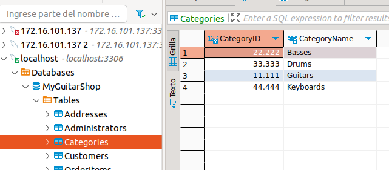

# INFORME GENERAL SOBRE LA IMPLEMENTACION DE BASE DE DATOS MEDIANTE BETTY
---
## IMPLEMENTACION BASE DE DATOS EJERCICIO 1 FILTRO

- Creacion de base de datos
    ```mysql
    CREATE DATABASE MyGuitarShop;
    USE MyGuitarShop;
    ```


- Creacion de tablas
    ```mysql
    CREATE TABLE Categories (
      CategoryID        INT            PRIMARY KEY ,
      CategoryName      VARCHAR(255)   NOT NULL      UNIQUE
    );
    ```
---

  
    CREATE TABLE Products (
      ProductID         INT,
      CategoryID        INT, 
      ProductCode       VARCHAR(10)    NOT NULL      UNIQUE,
      ProductName       VARCHAR(255)   NOT NULL,
      Description       TEXT           NOT NULL,
      ListPrice         DOUBLE          NOT NULL,
      DiscountPercent   DOUBLE          NOT NULL      DEFAULT 0.00,
      DateAdded         DATETIME                     DEFAULT NULL,
      PRIMARY KEY (ProductID, CategoryID),
      FOREIGN KEY (CategoryID) REFERENCES Categories(CategoryID)
    );
 
---

    ```
    CREATE TABLE Customers (
      CustomerID           INT            PRIMARY KEY,
      EmailAddress         VARCHAR(255)   NOT NULL      UNIQUE,
      Password             VARCHAR(60)    NOT NULL,
      FirstName            VARCHAR(60)    NOT NULL,
      LastName             VARCHAR(60)    NOT NULL,
      ShippingAddressID    INT                          DEFAULT NULL,
      BillingAddressID     INT                          DEFAULT NULL
    );
    ```

    ```
    CREATE TABLE Addresses (
      AddressID          INT             ,
      CustomerID         INT            REFERENCES Customers (CustomerID),
      Line1              VARCHAR(60)    NOT NULL,
      Line2              VARCHAR(60)                  DEFAULT NULL,
      City               VARCHAR(40)    NOT NULL,
      State              VARCHAR(2)     NOT NULL,
      ZipCode            VARCHAR(10)    NOT NULL,
      Phone              VARCHAR(12)    NOT NULL,
      Disabled           INT            NOT NULL      DEFAULT 0,
      PRIMARY KEY(AddressID, CustomerID),
      FOREIGN KEY (CustomerID) REFERENCES Customers(CustomerID) 
    );
    ```
---

    ```
    CREATE TABLE Orders (
      OrderID           INT            ,
      CustomerID        INT,
      OrderDate         DATETIME       NOT NULL,
      ShipAmount        DOUBLE          NOT NULL,
      TaxAmount         DOUBLE         NOT NULL,
      ShipDate          DATETIME                    DEFAULT NULL,
      ShipAddressID     INT            NOT NULL,
      CardType          VARCHAR(50)    NOT NULL,
      CardNumber        CHAR(16)       NOT NULL,
      CardExpires       CHAR(7)        NOT NULL,
      BillingAddressID  INT            NOT NULL,
      PRIMARY KEY (OrderID,CustomerID ),
      FOREIGN KEY (CustomerID) REFERENCES Customers(CustomerID) 
    );
    ```
---

    ```
    CREATE TABLE OrderItems (
        ItemID             INT,
        OrderID            INT,           
        ProductID          INT ,          
        ItemPrice          DOUBLE  NOT NULL,
        DiscountAmount     DOUBLE  NOT NULL,
        Quantity           INT            NOT NULL,
        PRIMARY KEY (ItemID,OrderID, ProductID ),
        FOREIGN KEY (OrderID) REFERENCES Orders(OrderID),
        FOREIGN KEY (ProductID) REFERENCES Products(ProductID)
    );
    ```

    ```
    CREATE TABLE Administrators (
      AdminID           INT            PRIMARY KEY,
      EmailAddress      VARCHAR(255)   NOT NULL,
      Password          VARCHAR(255)   NOT NULL,
      FirstName         VARCHAR(255)   NOT NULL,
      LastName          VARCHAR(255)   NOT NULL
    );
    ```
---

- Verificar insersiones registros en las entidades
  - Entidad Addresses
    
  - Entidad Administrators
     
  - Entidad Customers
    
  - Entidad OrderItems
    
  - Entidad categories
    
  - Entidad Orders
    
  - Entidad Products
    

---

## IMPLEMENTACION BASE DE DATOS EJERCICIO 2 FILTRO

- Creacion de base de datos
    ```
    CREATE DATABASE downloadsUser;
    use downloadsUser;
    ```

- Creacion de tablas
    ```
    CREATE TABLE product (
    IdProduct         INT            PRIMARY KEY ,
    NameProduct       VARCHAR(100)   NOT NULL           
    );
    ```
    ```
    CREATE TABLE user (
        userId         INT            PRIMARY KEY ,
        EmailAddress   VARCHAR(100)   NOT NULL,
        FirstName      VARCHAR(100)   NOT NULL,
        LastName       VARCHAR(100)   NOT NULL          
    );
    ```
    ```
    CREATE TABLE download (
    IdDownload   INT,
    FileName     VARCHAR(100)     NOT NULL,
    timeDownload DATETIME         NOT NULL,
    IdProduct INT,
    userId    INT,
    PRIMARY key (IdDownload, IdProduct, userId),
    FOREIGN KEY (IdProduct) REFERENCES product(IdProduct),     
    FOREIGN KEY (userId) REFERENCES user(userId)
    );
    ```
---

- Verificar insersiones registros en las entidades
  - Entidad downloads
    
  - Entidad Productos
     
  - Entidad Users
    


